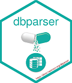

<!-- README.md is generated from README.Rmd. Please edit attributes file -->

# dbparser 

[](https://cran.r-project.org/package=dbparser)
[](https://app.codecov.io/gh/ropensci/dbparser)
[](https://www.repostatus.org/#active)
[](https://lifecycle.r-lib.org/articles/stages.html)
[](https://cran.r-project.org/package=dbparser)
[](https://www.rdocumentation.org/packages/dbparser)
[](https://bestpractices.coreinfrastructure.org/projects/3311)
[](https://github.com/ropensci/software-review/issues/347)

## Overview

Drugs databases vary too much in their formats and structures which
making related data analysis not a very easy job and requires a lot of
efforts to work on only two databases together such as
[DrugBank](https://go.drugbank.com/), [OnSIDES](https://onsidesdb.org/),
and [TWOSIDES](https://tatonettilab.org/resources/nsides/).

Hence, `dbparser` package aims to parse different public drugs databases
into a single and unified format R object called `dvobject` (stands for
drugverse object).

With recent updates, `dbparser` has evolved into an **integration
engine**, allowing you to merge mechanistic data (DrugBank) with
real-world phenotypic data (OnSIDES) and drug-drug interaction risks
(TWOSIDES).

That should help in:

- working with single data object and not multiple databases in
  different formats,
- using R analysis capabilities easily on drugs data,
- ease of transferring data between researchers after performing
  required data analysis or `dvobject` and storing results in the same
  object in a very easy manner.

### dvobject Structure

`dvobject` introduces a unified and compressed format of drugs data. It
is an R list object.

**For a single database (e.g., DrugBank):** It contains one or more of
the following sub-lists: - **drugs**: list of data.frames that contain
drugs information (i.e. synonyms, classifications, …) and it is the only
mandatory list - **salts**: data.frame contains drugs salts
information - **products**: data.frame of commercially available drugs
products in the world - **references**: data.frame of articles, links
and textbooks about drugs or CETT data - **cett**: list of data.frames
contain targets, enzymes, carriers and transporters information

**For a merged database (Integrated Pharmacovigilance):** When databases
are merged using `merge_drugbank_onsides` or `merge_drugbank_twosides`,
the `dvobject` becomes a nested structure containing: - **drugbank**:
The mechanistic hub. - **onsides**: The side-effect data (from FDA
labels). - **twosides**: The drug-drug interaction data. -
**integrated_data**: Enriched tables that bridge the databases (e.g.,
linking DrugBank IDs to OnSIDES adverse events). - **metadata**:
Detailed provenance for all contained datasets.

## Drug Databases

Parsers are available for the following databases (it is in progress
list)

### 1. DrugBank

[DrugBank](https://go.drugbank.com/) database is a comprehensive, freely
accessible, online database containing information on drugs and drug
targets. As both a bioinformatics and a cheminformatics resource,
DrugBank combines detailed drug (i.e. chemical, pharmacological and
pharmaceutical) data with comprehensive drug target (i.e. sequence,
structure, and pathway) information. More information about DrugBank can
be found [here](https://go.drugbank.com/about).

In its raw form, the DrugBank database is a single XML file. Users must
create an [account](https://go.drugbank.com/public_users/sign_up) with
DrugBank and request permission to
[download](https://go.drugbank.com/releases/latest) the database. Note
that this may take a couple of days.

The `dbparser` package parses the DrugBank XML database into `R` tibbles
that can be explored and analyzed by the user, check [this
tutorial](https://docs.ropensci.org/dbparser/articles/dbparser.html) for
more details.

If you are waiting for access to the DrugBank database, or do not intend
to do a deep dive with the data, you may wish to use the `dbdataset`
[package](https://interstellar-consultation-services.github.io/dbdataset/),
which contains the DrugBank database already parsed into `dvobject`.
Note that this is a large package that exceeds the limit set by CRAN. It
is only available on GitHub.

`dbparser` is tested against DrugBank versions *5.1.0* through *5.1.12*
successfully. If you find errors with these versions or any other
version please submit an issue
[here](https://github.com/ropensci/dbparser/issues).

### 2. OnSIDES (The Phenotype)

[OnSIDES](https://onsidesdb.org/) provides adverse drug events extracted
from thousands of FDA drug labels using machine learning. \* **Parser:**
`parseOnSIDES()` \* **Input:** Directory containing OnSIDES CSV files.

### 3. TWOSIDES (Polypharmacy)

[TWOSIDES](https://tatonettilab.org/resources/nsides/) provides data on
drug-drug interactions and the adverse events that arise when two drugs
are taken together. \* **Parser:** `parseTWOSIDES()` \* **Input:** The
`TWOSIDES.csv.gz` file.

## Quick Start: Integration Pipeline

The power of `dbparser` lies in its ability to chain parsers and mergers
together. Here is how you can build a complete pharmacovigilance
dataset:

``` r
library(dbparser)
library(dplyr)

# 1. Parse the raw databases
drugbank_db <- parseDrugBank("data/drugbank.xml")
onsides_db  <- parseOnSIDES("data/onsides/")
twosides_db <- parseTWOSIDES("data/TWOSIDES.csv.gz")

# 2. Build the Integrated Knowledge Graph
#    DrugBank serves as the hub. We chain the merges.
final_db <- drugbank_db %>% 
  merge_drugbank_onsides(onsides_db) %>% 
  merge_drugbank_twosides(twosides_db)

# 3. Analyze Results
#    Example: Accessing the enriched drug-drug interaction table
head(final_db$integrated_data$drug_drug_interactions)
```

For a detailed case study, please refer to the [Integrated
Pharmacovigilance
Vignette](https://docs.ropensci.org/dbparser/articles/integrated_pharmacovigilance.html).

## Installation

You can install the released version of dbparser from
[CRAN](https://CRAN.R-project.org) with:

``` r
install.packages("dbparser")
```

or you can install the latest updates directly from the repo

``` r
library(devtools)
devtools::install_github("ropensci/dbparser")
```

## Code of Conduct

Please note that the ‘dbparser’ project is released with a [Contributor
Code of
Conduct](https://docs.ropensci.org/dbparser/CODE_OF_CONDUCT.html). By
contributing to this project, you agree to abide by its terms.

## Contributing Guide

👍🎉 First off, thanks for taking the time to contribute! 🎉👍 Please
review our [Contributing
Guide](https://docs.ropensci.org/dbparser/CONTRIBUTING.html).

## Share the love ❤️

Think **dbparser** is useful? Let others discover it, by telling them in
person, via Twitter or a blog post.

Using **dbparser** for a paper you are writing? Consider citing it

``` r
citation("dbparser")
#> To cite dbparser in publications use:
#> 
#>   Mohammed Ali, Ali Ezzat ().  dbparser: DrugBank Database XML Parser.
#>   R package version 2.1.0.9002.
#> 
#> A BibTeX entry for LaTeX users is
#> 
#>   @Manual{,
#>     title = {DrugBank Database XML Parser},
#>     author = {Mohammed Ali and Ali Ezzat},
#>     organization = {Interstellar for Consultinc inc.},
#>     note = {R package version 2.1.0.9002},
#>     url = {https://CRAN.R-project.org/package=dbparser},
#>   }
```
