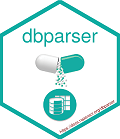

<!-- README.md is generated from README.Rmd. Please edit that file -->

# dbparser 

[](https://cran.r-project.org/package=dbparser)
[](https://joss.theoj.org/papers/3212f2fb07013b8fb1cec499bb9e8381)
[](https://github.com/ropensci/software-review/issues/347)
[](https://doi.org/10.5281/zenodo.18608628)
[](https://app.codecov.io/gh/ropensci/dbparser)
[](https://cran.r-project.org/package=dbparser)
[](https://bestpractices.coreinfrastructure.org/projects/3311)
[](https://lifecycle.r-lib.org/articles/stages.html)

## Overview

`dbparser` is an [rOpenSci](https://ropensci.org/) peer-reviewed R
package that parses and integrates major pharmacological databases into
standardized, analysis-ready R objects called `dvobject`s (drugverse
objects).

Pharmacological databases use incompatible formats and structures,
forcing researchers to write custom parsing scripts — a process that
consumes 60–80% of analysis time. `dbparser` eliminates this bottleneck
with unified parsing functions, chainable merge operations, and a
consistent output structure that enables reproducible, cross-database
analyses.

With recent updates, `dbparser` has evolved into an **integration
engine**, allowing you to merge mechanistic data (DrugBank) with
real-world phenotypic data (OnSIDES) and drug-drug interaction risks
(TWOSIDES).

## Installation

``` r
# From CRAN (stable)
install.packages("dbparser")

# From GitHub (development)
# install.packages("pak")
pak::pak("ropensci/dbparser")
```

## Supported Databases

### DrugBank (The Mechanistic Hub)

[DrugBank](https://go.drugbank.com/) is a comprehensive database
containing detailed drug, pharmacological, and target information. As
both a bioinformatics and a cheminformatics resource, DrugBank combines
detailed drug data (chemical, pharmacological, pharmaceutical) with
comprehensive drug target information (sequence, structure, pathway).
More information can be found [here](https://go.drugbank.com/about).

- **Parser:** `parseDrugBank()`
- **Input:** Full XML database
  ([download](https://go.drugbank.com/releases/latest) — requires free
  [account](https://go.drugbank.com/public_users/sign_up), may take a
  couple of days)
- **Tested versions:** 5.1.0 through 5.1.12
- **Alternative:** Use
  [dbdataset](https://interstellar-egypt.github.io/dbdataset/) for
  pre-parsed data without downloading the XML (GitHub only, exceeds CRAN
  size limit)
- **Tutorial:** [DrugBank Parsing
  Vignette](https://docs.ropensci.org/dbparser/articles/dbparser.html)

If you find errors with any DrugBank version, please submit an issue
[here](https://github.com/ropensci/dbparser/issues).

### OnSIDES (Adverse Drug Events)

[OnSIDES](https://onsidesdb.org/) provides adverse drug events extracted
from thousands of FDA drug labels using machine learning.

- **Parser:** `parseOnSIDES()`
- **Input:** Directory containing OnSIDES CSV files

### TWOSIDES (Drug-Drug Interactions)

[TWOSIDES](https://tatonettilab.org/resources/nsides/) provides data on
adverse events arising when two drugs are taken together.

- **Parser:** `parseTWOSIDES()`
- **Input:** `TWOSIDES.csv.gz` file

## Quick Start

### Parse a Single Database

``` r
library(dbparser)

# Parse DrugBank
drugbank_db <- parseDrugBank("data/drugbank.xml")

# Parse OnSIDES
onsides_db <- parseOnSIDES("data/onsides/")

# Parse TWOSIDES
twosides_db <- parseTWOSIDES("data/TWOSIDES.csv.gz")
```

### Integration Pipeline

The power of `dbparser` lies in its ability to chain parsers and mergers
together. Here is how you can build a complete pharmacovigilance
dataset:

``` r
library(dbparser)
library(dplyr)

# 1. Parse the raw databases
drugbank_db <- parseDrugBank("data/drugbank.xml")
onsides_db  <- parseOnSIDES("data/onsides/")
twosides_db <- parseTWOSIDES("data/TWOSIDES.csv.gz")

# 2. Build the Integrated Knowledge Graph
#    DrugBank serves as the hub. Chain the merges.
final_db <- drugbank_db %>%
  merge_drugbank_onsides(onsides_db) %>%
  merge_drugbank_twosides(twosides_db)

# 3. Analyze Results
head(final_db$integrated_data$drug_drug_interactions)
```

For a detailed case study, see the [Integrated Pharmacovigilance
Vignette](https://docs.ropensci.org/dbparser/articles/drugbank_nside.html).

## The dvobject Structure

`dvobject` is a unified, compressed format for pharmacological data — an
R list object that preserves complex relational hierarchies while
enabling consistent access patterns.

**For a single database (e.g., DrugBank):**

- **drugs**: list of data frames containing drug information (synonyms,
  classifications, etc.) — the only mandatory component
- **salts**: data frame of drug salt information
- **products**: data frame of commercially available drug products
  worldwide
- **references**: data frame of articles, links, and textbooks about
  drugs or CETT data
- **cett**: list of data frames containing targets, enzymes, carriers,
  and transporters information

**For a merged database (Integrated Pharmacovigilance):**

When databases are merged using `merge_drugbank_onsides` or
`merge_drugbank_twosides`, the `dvobject` becomes a nested structure:

- **drugbank**: The mechanistic hub
- **onsides**: Side-effect data (from FDA labels)
- **twosides**: Drug-drug interaction data
- **integrated_data**: Enriched tables bridging databases (e.g., linking
  DrugBank IDs to OnSIDES adverse events)
- **metadata**: Detailed provenance for all contained datasets

## Research Impact

`dbparser` has enabled **10+ peer-reviewed publications** in leading
journals:

| Domain | Journal | Reference |
|----|----|----|
| Alzheimer’s Drug Repurposing | *Nature Scientific Reports* | Parolo et al. (2023) |
| COVID-19 Therapeutics | *Pharmaceutics* | Pérez-Moraga et al. (2021) |
| Pan-Cancer Biomarkers | *Briefings in Bioinformatics* | Mercatelli et al. (2022) |
| Pathway Modeling | *Computer Methods and Programs in Biomedicine* | Hammoud et al. (2025) |
| Clinical Trial Analysis | *Frontiers in Pharmacology* | Namiot et al. (2023) |

📊 **50,000+ CRAN downloads** \| Featured in the [CRAN Epidemiology Task
View](https://cran.r-project.org/web/views/Epidemiology.html)

For the full list, see our [JOSS
paper](https://joss.theoj.org/papers/3212f2fb07013b8fb1cec499bb9e8381).

## Ecosystem

| Package | Description | Links |
|----|----|----|
| [dbdataset](https://interstellar-egypt.github.io/dbdataset/) | Pre-parsed DrugBank datasets ready for analysis | [GitHub](https://github.com/interstellar-egypt/dbdataset) |
| [covid19dbcand](https://github.com/interstellar-egypt/covid19dbcand) | COVID-19 drug candidate datasets | [GitHub](https://github.com/interstellar-egypt/covid19dbcand) |
| [periscope2](https://periscopeapps.org/) | Shiny framework for interactive dashboards | [CRAN](https://cran.r-project.org/package=periscope2) |

## Citation

If you use `dbparser` in published research, please cite our JOSS paper:

    Ali et al., (2026). dbparser: An R Package for Parsing and Integrating
    Pharmacological Databases. Journal of Open Source Software, 11(118),
    9950, https://doi.org/10.21105/joss.09950

``` r
citation("dbparser")
```

If you find `dbparser` useful, consider ⭐ starring the [GitHub
repository](https://github.com/ropensci/dbparser) and sharing it with
colleagues.

## Enterprise Support

For custom database integrations, enterprise support, training, or
deployment assistance — `dbparser` is maintained by [Interstellar
Consultation Services](https://interstellar-egypt.com).

📧 <info@interstellar-egypt.com>

## Contributing

We welcome contributions! Please review our [Contributing
Guide](https://docs.ropensci.org/dbparser/CONTRIBUTING.html).

Please note that the `dbparser` project is released with a [Contributor
Code of
Conduct](https://docs.ropensci.org/dbparser/CODE_OF_CONDUCT.html). By
contributing to this project, you agree to abide by its terms.

[](https://ropensci.org)
