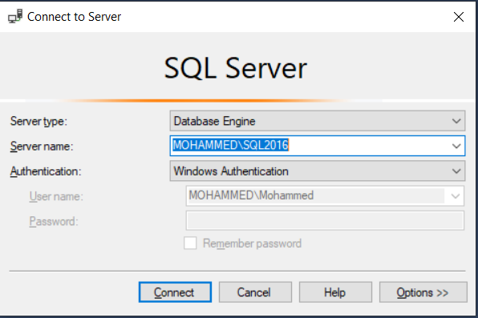
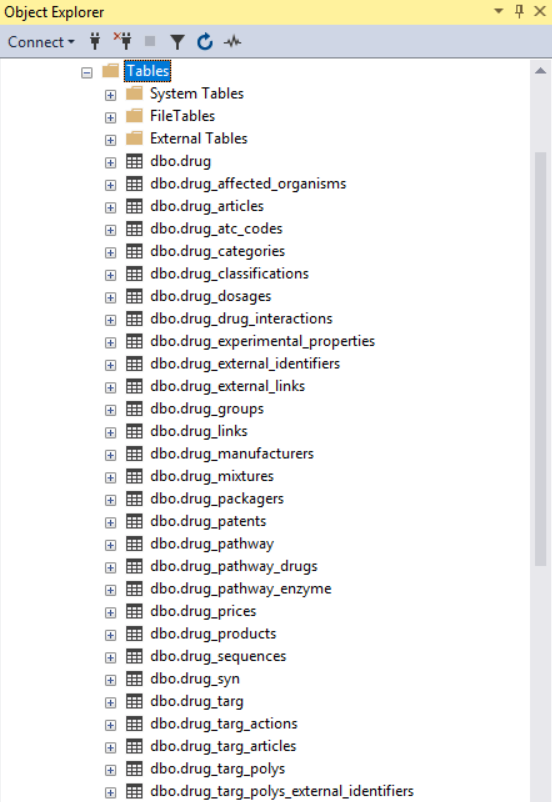

```{r setup, include = FALSE}
knitr::opts_chunk$set(
  collapse = TRUE,
  comment = "#>",
  fig.path = "docs/articles/",
  out.width = "100%"
)
```

## Introduction
This tutorial aims to explain how `dbparser` can work along with R database functionalities to save parsed drug tibbles to the user desired databases.
This tutorial addresses the following three options:

- [SQLite](https://github.com/r-dbi/RSQLite)
- [RDBMS](https://db.rstudio.com/dbi/)
- [Maria Knowledge Base](https://github.com/r-dbi/RMariaDB)


*Please note that this tutorial does not explain how to install these databases as it is out of scope.*

### SQLite
SQLite is an inmemory database you can use locally easily. To save drug information using this database run the following
```{r eval = FALSE}
# Load dbparser package
library(dbparser)
# Create SQLite database connection
database_connection <- DBI::dbConnect(RSQLite::SQLite(), ":memory:")
# DrugBank database sample name
biotech <- "drugbank_record_biotech.xml"
# Use DrugBank sample database in the library
read_drugbank_xml_db(system.file("extdata", biotech, package = "dbparser"))
# Parse all available drug tibbles
drug_all(save_table = TRUE, database_connection = database_connection)
# List saved tables
DBI::dbListTables(database_connection)
# Close SQLite connection
DBI::dbDisconnect(database_connection)
```


### DBI Supported Databases

`DBI` separates the connectivity to the DBMS into a *front-end* and a *back-end*. Applications use only the exposed front-end API. The back-end facilities that communicate with specific DBMSs (SQLite, MySQL, PostgreSQL, MonetDB, etc.) are provided by drivers (other packages) that get invoked automatically through S4 methods.
For more information about DBI package please refer to [this link](https://db.rstudio.com/dbi/)

The following are two examples of how to make the connection with *SQL Server* and *Maria DB*

#### SQL Server

* Make sure you have a working connection to *SQL Server* instance

* Create new empty database to store drug information

* Execute the following commands
```{r eval=FALSE}
# Load dneeded packages
library(dbparser)
library(odbc)
# Create SQLServer database connection
con <- DBI::dbConnect(odbc::odbc(), Driver = "SQL Server", Server = "MOHAMMED\\SQL2016", 
    Database = "drugbank", Trusted_Connection = T)
# Use DrugBank sample database in the library
biotech <- "drugbank_record_biotech.xml"	
# DrugBank database sample name
read_drugbank_xml_db(system.file("extdata", biotech, package = "dbparser"))
# Parse all available drug tibbles
drug_all(save_table = TRUE, database_connection = con)
# List saved tables
DBI::dbListTables(con)
# Close SQLServer connection
DBI::dbDisconnect(con)
```

Then referesh your database to see new tables


#### Maria Knowledge Base

* Install MariaDB
* Install MySQL client for MariaDB
* Create new empty database to store drug information


* Execute the following commands
```{r eval=FALSE}
# Load dneeded packages
library(dbparser)
library(RMariaDB)
# Create SQLServer database connection
con <- RMariaDB::dbConnect(RMariaDB::MariaDB(), Server = "MariaDB",
                           dbname = "drugbank", username="root",
                           password="root")
# Use DrugBank sample database in the library
biotech <- "drugbank_record_biotech.xml"	
# DrugBank database sample name
read_drugbank_xml_db(system.file("extdata", biotech, package = "dbparser"))
# Parse all available drug tibbles
drug_all(save_table = TRUE, database_connection = con)
# List saved tables
RMariaDB::dbListTables(con)
# Close SQLServer connection
RMariaDB::dbDisconnect(con)
```

Then referesh your database to see new tables

