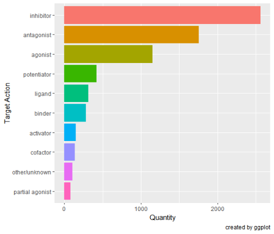

```{r setup, include = FALSE}
knitr::opts_chunk$set(
  collapse = TRUE,
  comment = "#>",
  fig.path = "docs/articles/",
  out.width = "100%"
)
```

## Introduction
The main purpose of the `dbparser` package is to parse the 
[DrugBank](https://go.drugbank.com/) database which is downloadable in XML format 
from [this link](https://go.drugbank.com/releases/latest). The parsed data can 
then be explored and analyzed as desired by the user. 
In this tutorial, we will see how to use `dbparser` along with `dplyr` and 
`ggplot2` along with other libraries to do simple drug analysis

## Loading and Parsing the Data

Before starting the code we are assuming the following:

- user already downloaded *DrugBank* xml database file based on the
[Read Me](https://docs.ropensci.org/dbparser/) instructions or the above note,
- user saved the downloaded database in working directory as `C:\`.
- user named the downloaded xml file **drugbank.xml**. 

Now we can loads the `drugs` info, `drug groups` info and `drug targets`
actions info.

```{r eval=FALSE}
## load dbparser package
library(dbparser)
library(dplyr)
library(ggplot2)
library(XML)

## parse data from XML and save it to memory
dvobj <- parseDrugBank("C:\drugbank.xml")

## load drugs data
drugs <- dvobj$drugs$general_information

## load drug groups data
drug_groups <- dvobj$drugs$groups

## load drug targets actions data
drug_targets_actions <- dvobj$cett$targets$actions
```


## Exploring the data

Following is an example involving a quick look at a few aspects of the parsed 
data. First we look at the proportions of `biotech` and `small-molecule` drugs 
in the data.

```{r eval=FALSE}
## view proportions of the different drug types (biotech vs. small molecule)
drugs %>% 
    select(type) %>% 
    ggplot(aes(x = type, fill = type)) + 
    geom_bar() + 
    guides(fill = FALSE)     ## removes legend for the bar colors
```


Below, we view the different `drug_groups` in the data and how prevalent they 
are.

```{r eval=FALSE}
## view proportions of the different drug types for each drug group
drugs %>% 
    full_join(drug_groups, by = c('primary_key' = 'drugbank_id')) %>% 
    select(type, group) %>% 
    ggplot(aes(x = group, fill = type)) + 
    geom_bar() + 
    theme(legend.position = 'bottom') + 
    labs(x = 'Drug Group', 
         y = 'Quantity', 
         title = "Drug Type Distribution per Drug Group", 
         caption = "created by ggplot") + 
    coord_flip()
```

Finally, we look at the `drug_targets_actions` to observe their proportions as 
well.


```{r eval=FALSE}
## get counts of the different target actions in the data
targetActionCounts <- 
    drug_targets_actions %>% 
    group_by(action) %>% 
    summarise(count = n()) %>% 
    arrange(desc(count))

## get bar chart of the 10 most occurring target actions in the data
p <- 
    ggplot(targetActionCounts[1:10,], 
           aes(x = reorder(action,count), y = count, fill = letters[1:10])) + 
    geom_bar(stat = 'identity') +
    labs(fill = 'action', 
         x = 'Target Action', 
         y = 'Quantity', 
         title = 'Target Actions Distribution', 
         subtitle = 'Distribution of Target Actions in the Data',
         caption = 'created by ggplot') + 
    guides(fill = FALSE) +    ## removes legend for the bar colors
    coord_flip()              ## switches the X and Y axes

## display plot
p
```


